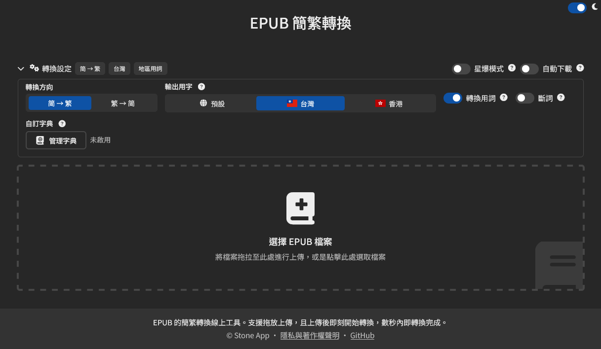

# EPUB Convert

EPUB 的簡繁轉換線上工具。支援拖放上傳，且上傳後即刻開始轉換，數秒內即轉換完成。



立刻體驗: https://epub.stoneapp.tech/

## 功能
- 支援 EPUB 簡繁互相轉換
- 支援一次最多 25 本 EPUB 的批次轉換，並會自動略過失敗的檔案
- 支援各地區用語轉換
- 開啟用語轉換時，可開啟 jieba 斷詞以提升轉換品質
- 支援自訂字典，可在瀏覽器中儲存，也可以 JSON 匯入或匯出
- 支援 PWA 安裝，使用過的轉換模式可離線載入
- 支援 command line 使用，也支援平行轉換

## 如何使用
### Web
因為使用了 Worker 與 WASM，檔案必須透過網頁伺服器 (http(s)://) 才能使用，不能直接打開 `index.html` (file://)。

以下使用 Python 內建的 `http.server` 為例，在專案根目錄執行以下指令:

```
python -m http.server 8000
```

即可在本機的 http://localhost:8000 存取此工具。

### Command-Line
需要 Node.js 18 或更新版本。

此 command line 版本使用與 Web 版相同的 OpenCC WASM 轉換引擎。可以透過 `npm run convert` 來使用此工具，需要先安裝 npm 套件:

```
npm ci
```

可將檔名作為參數，預設會轉換到原檔案相同的資料夾:

```
npm run convert -- --mode s2twp --jieba --jobs 4 book1.epub book2.epub
```

也可以指定資料夾，會轉換該資料夾第一層的所有 `.epub` 檔案:

```
npm run convert -- --mode t2s --jobs 2 --output-dir converted books/
```

使用 `--dictionary`（或 `-d`）套用自訂詞典。
純文字字典的格式與網頁相同，每行一組來源詞跟目標詞，用空白隔開。或是也可以直接使用 Web 版匯出的 JSON。  
另外，選項可重複使用以合併多個檔案:

```
npm run convert -- -d terms.txt --dictionary names.json books/
```

其他參數的完整說明，可以參閱 `npm run convert -- --help`。

### 更新第三方套件
```
npm ci
npm run vendor:update
```

## 第三方套件
- [OpenCC-wasm](https://www.npmjs.com/package/opencc-wasm)
- [TocasUI](https://tocas-ui.com)
- [Zip.js](https://gildas-lormeau.github.io/zip.js/)
- [Vue.js](https://vuejs.org)

第三方套件之開放原始碼授權請見 [THIRD_PARTY_NOTICES.md](./THIRD_PARTY_NOTICES.md)

## 授權
MIT
